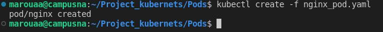

#### We are going to  create a Pod.
- A **pod** is simply a group of one or more containers, with storage and a shared network. As a result, these containers communicate more effectively with each other and ensure a location of the data.

- there are two types of pods:
 - **pod with single container**
 - **pod with multiple container**

##### Creation of the Pod:
- Chasqe object of kubernets  you want to create must have values for the following fields:

 - **apiversion**: The version of the kubernets API you use to create this object.

 - **kind**; the type of k8s object you expect to create 
 - **metada**: data of key type value to uniquely identify the object.
 - **spec**: contains the specification with nested fields specific to each k8s object. the format is therefore different for each kubernets object.
##### Create file nginx-pod.yaml (pod with just one container)

- run the command **Minikube** to create Kubernetes Clusters 

 -  ```shell
Minikube start
```


- 

- run the command **kubectl create -f** to create the Pod 

 -  ```shell
kubectl create -f nginx-pod.yaml
```
- 

- run the command **kubectl get pods** to verify the Pod 

 -  ```shell
kubectl get pod
``` 

![Optional Text]


##### Create file nginx-pod.yaml (pod with two one container)

